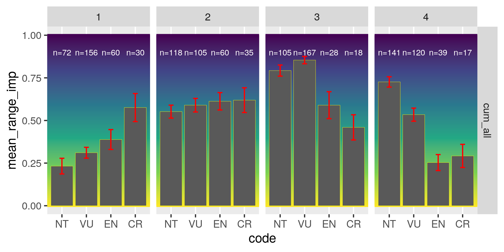
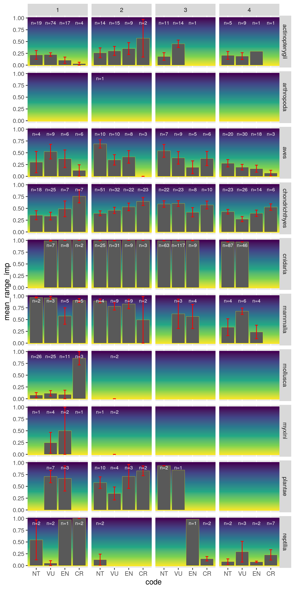
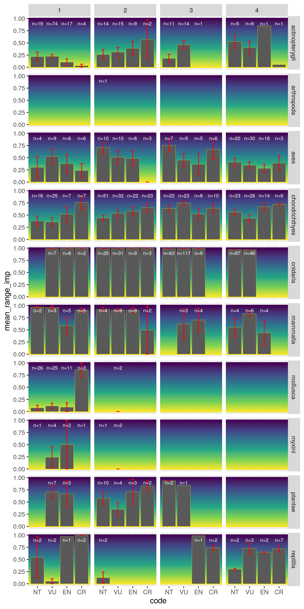

``` {r setup, echo = TRUE, message = FALSE, warning = FALSE}

knitr::opts_chunk$set(fig.width = 6, fig.height = 4, fig.path = 'figs/',
                      echo = TRUE, message = FALSE, warning = FALSE)

library(raster)
library(sf)
library(cowplot)
source('https://raw.githubusercontent.com/oharac/src/master/R/common.R')
source(here('common_fxns.R'))
reload <- FALSE
```


# Summary

Create figures for SI:

* impacted range (cumulative) to IUCN risk category
* impacted range (by stressor) to impact score by stressor

# Methods

## SI: impacted range (cumulative) to IUCN risk category

```{r gather data}
imp_range_summary_f <- here('_output/imp_range_by_spp_2013.csv')
if(!file.exists(imp_range_summary_f)) {
  imp_range_files <- list.files(file.path(dir_bd_anx, 'spp_impacts'), 
                                # pattern = '_all.csv',
                                full.names = TRUE)
  
  imp_ranges <- parallel::mclapply(imp_range_files, 
                                   FUN = function(f) { # f <- imp_range_files[1]
                                     type <- str_replace_all(f, '.+_|.csv', '')
                                     x <- read_csv(f) %>%
                                       mutate(stressor = str_replace(stressor, 'ulative', paste0('_', type)))
                                     return(x)
                                   }, 
                                   mc.cores = 16) %>%
    bind_rows() %>%
    filter(year == 2013 & eez == 0) %>%
    select(stressor, impact_km2, 
           # impact_2plus_km2, impact_3plus_km2, 
           range_km2, iucn_sid)
  
  write_csv(imp_ranges, imp_range_summary_f)
}
imp_range_all <- read_csv(imp_range_summary_f)

```

```{r gather data coastal}
imp_range_coastal_f <- here('_output/imp_range_by_spp_coastal_2013.csv')
if(!file.exists(imp_range_coastal_f)) {
  imp_range_files <- list.files(file.path(dir_bd_anx, 'spp_impacts_coastal'), 
                                # pattern = '_all.csv',
                                full.names = TRUE)
  
  imp_range_coastal <- parallel::mclapply(imp_range_files, 
                 FUN = function(f) { # f <- imp_range_files[1]
                   type <- str_replace_all(f, '.+_|.csv', '')
                   id <- str_extract(basename(f), '[0-9]+') %>% as.integer
                   x <- read_csv(f) %>%
                     mutate(stressor = str_replace(stressor, 'ulative', paste0('_', type)),
                            iucn_sid = id)
                   return(x)
                 }, mc.cores = 16) %>%
    bind_rows() %>%
    filter(year == 2013) %>%
    select(stressor, impact_km2, coastal_km2, iucn_sid)

  write_csv(imp_range_coastal, imp_range_coastal_f)
}
imp_range_coastal <- read_csv(imp_range_coastal_f)

```

``` {r}
spp_risk <- get_incl_spp() %>%
  select(iucn_sid, sciname, desc, taxon, cat_score) %>%
  distinct()

spp_ranges <- get_spp_range() %>%
  filter(eez == 0) %>%
  filter(iucn_sid %in% spp_risk$iucn_sid) %>%
  mutate(range_gp = ntile(range_km2, n = 4)) %>%
  # mutate(range_gp = Hmisc::cut2(range_km2, g=4)) %>%
  # mutate(range_gp = case_when(range_km2 < 1e5 ~ '[0, 1e5)',
  #                             range_km2 < 1e6 ~ '[1e5, 1e6)',
  #                             range_km2 < 5e6 ~ '[1e6, 5e6)',
  #                             TRUE ~ sprintf('[5e6, 3.5e8]'))) %>%
  select(iucn_sid, range_km2, range_gp) %>%
  mutate(range_gp_num = as.integer(range_gp))

# table(spp_ranges$range_gp)
hist(log(spp_ranges$range_km2))
```

```{r calc impacts for all range}
cat_vals <- data.frame(code = c('NT', 'VU', 'EN', 'CR'),
                       cat_score = c(.2, .4, .6, .8))

cum_range <- imp_range_all %>%
  filter(str_detect(stressor, '^cum_all')) %>%
  # filter(impact_km2 > 0) %>%
  mutate(imp_range_pct = impact_km2 / range_km2,
         imp_range_pct = ifelse(is.na(imp_range_pct), 0, imp_range_pct)) %>%
  select(imp_range_pct, range_km2, iucn_sid, stressor) %>%
  left_join(spp_risk, by = 'iucn_sid') %>%
  left_join(cat_vals, by = 'cat_score') %>%
  left_join(spp_ranges, by = 'iucn_sid') %>%
  arrange(cat_score) %>%
  mutate(code = fct_inorder(code))

mdl1 <- lm(cat_score ~ imp_range_pct + range_gp + imp_range_pct * range_gp + taxon,
           data = cum_range)
summary(mdl1)


cum_range_sum <- cum_range %>%
  group_by(code, range_gp, stressor) %>%
  summarize(mean_range_imp = mean(imp_range_pct),
            med_range_imp  = median(imp_range_pct),
            sd_range_imp   = sd(imp_range_pct),
            se_range_imp   = sd_range_imp / sqrt(n()),
            n_spp = paste0('n=', n_distinct(iucn_sid))) %>%
  ungroup()

cum_range_by_taxa <- cum_range %>%
  group_by(code, range_gp, stressor, taxon) %>%
  summarize(mean_range_imp = mean(imp_range_pct),
            med_range_imp  = median(imp_range_pct),
            sd_range_imp   = sd(imp_range_pct),
            se_range_imp   = sd_range_imp / sqrt(n()),
            n_spp = paste0('n=', n_distinct(iucn_sid))) %>%
  ungroup()

```

```{r calc impacts for coastal range}
cum_range_coastal <- imp_range_coastal %>%
  filter(str_detect(stressor, '^cum_all')) %>%
  # filter(impact_km2 > 0) %>%
  mutate(imp_range_pct = impact_km2 / coastal_km2,
         imp_range_pct = ifelse(is.na(imp_range_pct), 0, imp_range_pct)) %>%
  select(imp_range_pct, iucn_sid, stressor) %>%
  left_join(spp_risk, by = 'iucn_sid') %>%
  left_join(cat_vals, by = 'cat_score') %>%
  left_join(spp_ranges, by = 'iucn_sid') %>%
  arrange(cat_score) %>%
  mutate(code = fct_inorder(code))

mdl2 <- lm(cat_score ~ imp_range_pct + range_gp + imp_range_pct * range_gp + taxon, 
           data = cum_range_coastal)
summary(mdl2)

cum_range_coastal_sum <- cum_range_coastal %>%
  group_by(code, range_gp, stressor) %>%
  summarize(mean_range_imp = mean(imp_range_pct),
            med_range_imp  = median(imp_range_pct),
            sd_range_imp   = sd(imp_range_pct),
            se_range_imp   = sd_range_imp / sqrt(n()),
            n_spp = paste0('n=', n_distinct(iucn_sid))) %>%
  ungroup()

cum_range_coastal_by_taxa <- cum_range_coastal %>%
  group_by(code, range_gp, stressor, taxon) %>%
  summarize(mean_range_imp = mean(imp_range_pct),
            med_range_imp  = median(imp_range_pct),
            sd_range_imp   = sd(imp_range_pct),
            se_range_imp   = sd_range_imp / sqrt(n()),
            n_spp = paste0('n=', n_distinct(iucn_sid))) %>%
  ungroup()

```

### just look at cumulative impacted range...

No weight given to multiple stressors overlapping

#### Full range

```{r plot for full range}
grad_x <- data.frame(y = seq(0, 1, .005))

x <- ggplot(cum_range_sum, aes(x = code, y = mean_range_imp)) +
  geom_hline(data = grad_x, aes(yintercept = y, color = y), size = 1, show.legend = FALSE) +
  scale_color_viridis_c(direction = -1, option = 'viridis') +
  geom_col(color = 'yellow', size = .1) +
  geom_errorbar(aes(ymin = mean_range_imp - se_range_imp,
                    ymax = mean_range_imp + se_range_imp),
                color = 'red', width = .2) +
  geom_text(aes(label = n_spp), y = .9, size = 2.5, color = 'white') +
  facet_grid(stressor ~ range_gp)
  
ggsave('figSI_compare_range_to_risk.png', width = 6, height = 3)


```

#### coastal range only

```{r plot for coastal range}

x <- ggplot(cum_range_coastal_sum, aes(x = code, y = mean_range_imp)) +
  geom_hline(data = grad_x, aes(yintercept = y, color = y), size = 1, show.legend = FALSE) +
  scale_color_viridis_c(direction = -1, option = 'viridis') +
  geom_col(color = 'yellow', size = .1) +
  geom_errorbar(aes(ymin = mean_range_imp - se_range_imp,
                    ymax = mean_range_imp + se_range_imp),
                color = 'red', width = .2) +
  geom_text(aes(label = n_spp), y = .9, size = 2.5, color = 'white') +
  facet_grid(stressor ~ range_gp)
  
ggsave('figSI_compare_range_to_risk_coastal.png', width = 6, height = 3)
knitr::include_graphics('figSI_compare_range_to_risk_coastal.png')

```

### by taxon

#### Full range

```{r plot for full range by taxa}
grad_x <- data.frame(y = seq(0, 1, .005))

x <- ggplot(cum_range_by_taxa, aes(x = code, y = mean_range_imp)) +
  geom_hline(data = grad_x, aes(yintercept = y, color = y), size = 1, show.legend = FALSE) +
  scale_color_viridis_c(direction = -1, option = 'viridis') +
  geom_col(color = 'yellow', size = .1) +
  geom_errorbar(aes(ymin = mean_range_imp - se_range_imp,
                    ymax = mean_range_imp + se_range_imp),
                color = 'red', width = .2) +
  geom_text(aes(label = n_spp), y = .9, size = 2.5, color = 'white') +
  facet_grid(taxon ~ range_gp)
  
ggsave('figSI_compare_range_to_risk_taxa.png', width = 6, height = 12)


```

#### coastal range only

```{r plot for coastal range by taxa}

x <- ggplot(cum_range_coastal_by_taxa, aes(x = code, y = mean_range_imp)) +
  geom_hline(data = grad_x, aes(yintercept = y, color = y), size = 1, show.legend = FALSE) +
  scale_color_viridis_c(direction = -1, option = 'viridis') +
  geom_col(color = 'yellow', size = .1) +
  geom_errorbar(aes(ymin = mean_range_imp - se_range_imp,
                    ymax = mean_range_imp + se_range_imp),
                color = 'red', width = .2) +
  geom_text(aes(label = n_spp), y = .9, size = 2.5, color = 'white') +
  facet_grid(taxon ~ range_gp)
  
ggsave('figSI_compare_range_to_risk_coastal_taxa.png', width = 6, height = 12)


```

## Examine spp at various range sizes

Are large-ranged CR species more vulnerable to land-based stressors incl invasives?

```{r}
chi_lookup <- read_csv(here('_raw/iucn_threat_to_stressor_lookup.csv')) %>%
  mutate(stressor = str_split(stressor, ';')) %>%
  unnest(stressor) %>%
  filter(str_detect(stressor, '[a-z]'))

x <- read_csv(file.path(dir_bd_anx, 'iucn/threats',
                               sprintf('iucn_spp_threats_%s.csv', api_version))) %>%
  select(code, title) %>%
  distinct() %>%
  mutate(main = str_extract(code, '[0-9]+\\.[0-9]+'),
         sub  = str_extract(code, '[0-9]+\\.[0-9]+\\.[0-9]+'))

y <- x %>% filter(code == main) %>% select(main, title)
z <- x %>% filter(code == sub) %>% select(main, sub, desc = title)
zz <- y %>% left_join(z, by = 'main') %>%
  mutate(code = ifelse(is.na(sub), main, sub),
         title = ifelse(is.na(sub), title, paste0(title, ': ', desc))) %>%
  select(code, title) %>%
  bind_rows(y %>% rename(code = main)) %>%
  mutate(title = str_replace(title, 'Named species \\(.+', 'Named species')) %>%
  distinct()

spp_threats <- read_csv(file.path(dir_bd_anx, 'iucn/threats',
                               sprintf('iucn_spp_threats_%s.csv', api_version))) %>%
  select(iucn_sid, code, score, invasive, score_num) %>%
  left_join(zz, by = 'code') %>%
  filter(!is.na(score_num)) %>%
  left_join(chi_lookup, by = 'code') %>%
  select(-desc) %>%
  inner_join(spp_risk, by = 'iucn_sid') %>%
  left_join(spp_ranges, by = 'iucn_sid') %>%
  mutate(category = ifelse(is.na(category), 'other', category)) %>%
  distinct()

### examine large-ranged species with "other" threats
spp_big <- spp_threats %>%
  filter(range_gp == 4) %>%
  select(iucn_sid, sciname, taxon, cat_score, code, title, category) %>%
  distinct()

DT::datatable(spp_big %>% filter(cat_score == 0.2))
DT::datatable(spp_big %>% filter(cat_score == 0.4))
DT::datatable(spp_big %>% filter(cat_score == 0.6))
DT::datatable(spp_big %>% filter(cat_score == 0.8))

```

## Which taxa are represented in the various range classes?

```{r}
taxa_threats <- spp_threats %>%
  select(taxon, cat_score, range_gp, iucn_sid) %>%
  distinct()

table(taxa_threats %>% select(-iucn_sid))
```

